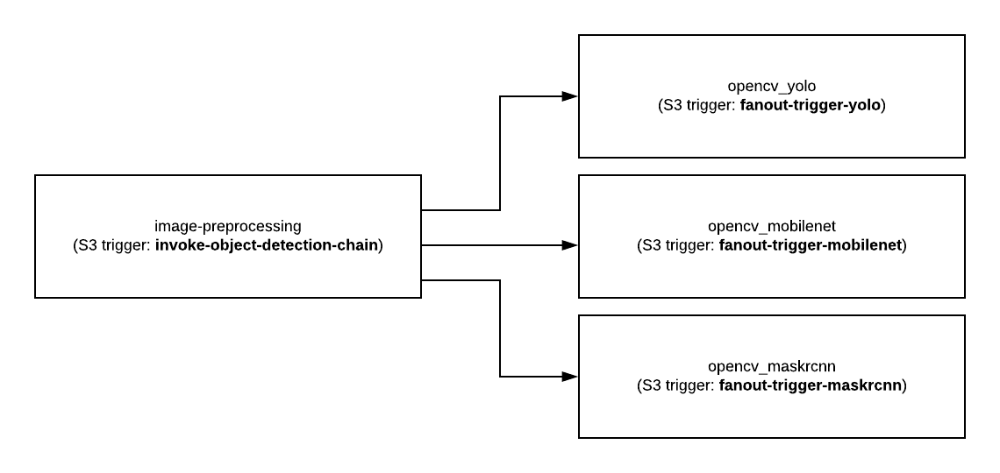

Copied from 
https://github.com/CU-BISON-LAB/ServerlessMeasurementsApplications/tree/master/aws-opencv-objectdetection-chain
Modified for cloudlab and couchdb 

The function chain invokes three different object detection models in a fan-out fashion.

The input is an image.

The function chain has 4 lambdas.

lambda1 is invoked by adding an image to s3 bucket. After preprocessing is done, it gets uploaded to three different buckets which invoke three different models for image recognition.

Note: Functions, layers and buckets are all on us-west-1

Credits:

For creating opencv layer :

https://www.bigendiandata.com/2019-04-15-OpenCV_AWS_Lambda/

For creating numpy layer:

https://medium.com/@qtangs/creating-new-aws-lambda-layer-for-python-pandas-library-348b126e9f3e

Using opencv with various models:

https://www.pyimagesearch.com
